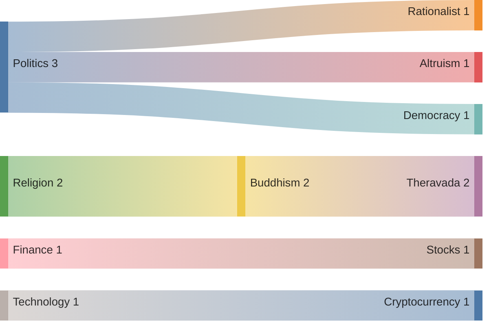
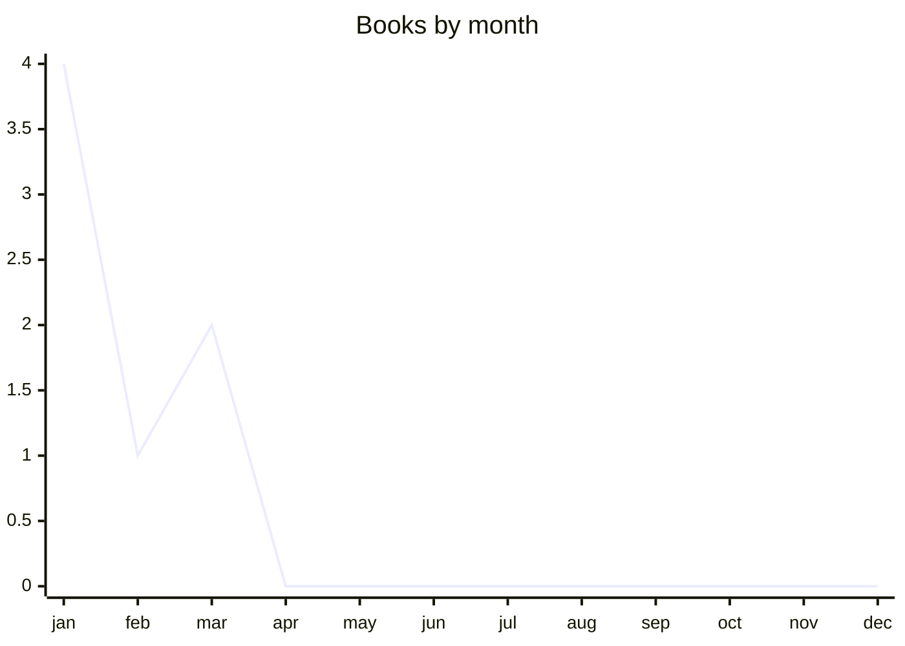

# [[Reading]]

## Charts

## Log

| **Date**     | **Title**                                 | **Category** | **Rating** | **Type**    | **Format** |
| ------------ | ----------------------------------------- | ------------ | ---------- | ----------- | ---------- |
| **01/01/25** | Effective Altruism, Magnus Vinding        | Politics     | 8          | Non-Fiction | Digital    |
| **13/01/25** | Autocracy Inc                             | Politics     | 7          | Non-Fiction | Audiobook  |
| **17/01/25** | Random walk down wallstreet               | Finance      | 5          | Non-Fiction | Digital    |
| **22/01/25** | Essence of the Heart sutra, Tenzin Gyatso | Buddhism     | 6          | Non-Fiction | Audiobook  |
| **04/02/25** | Living Theravada                          | Buddhism     | 5          | Non-Fiction | Digital    |
| **20/03/25** | Bitcoin: an ecash p2p system              | Technology   | 8          | Non-Fiction | Digital    |
| **28/03/25** | The scout mindset                         | Politics     | 9          | Non-Fiction | Digital    |

