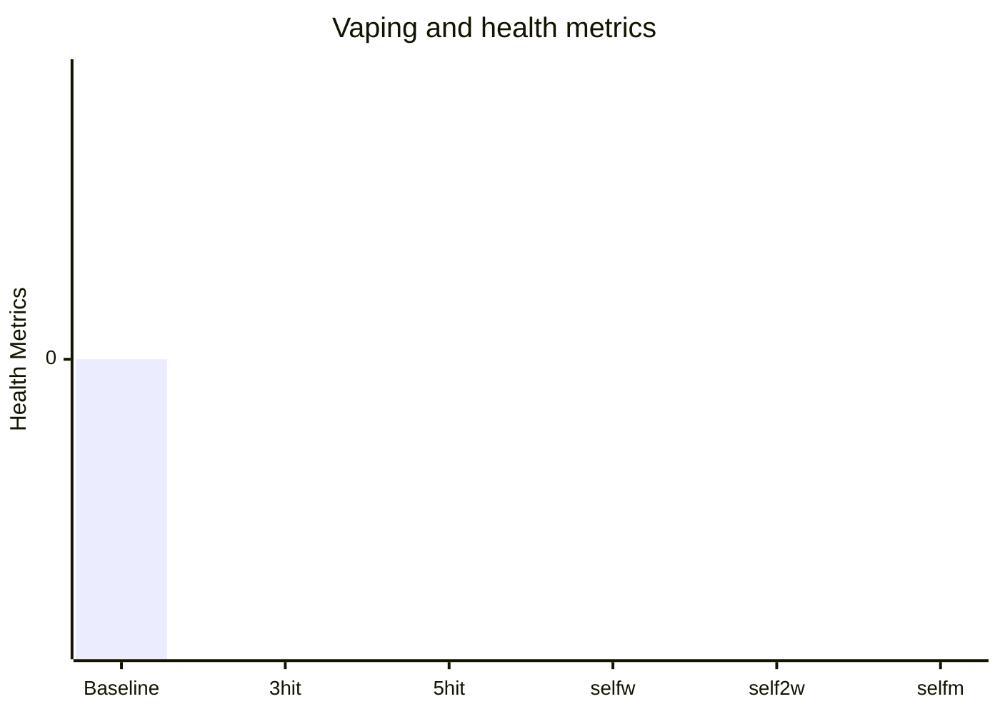
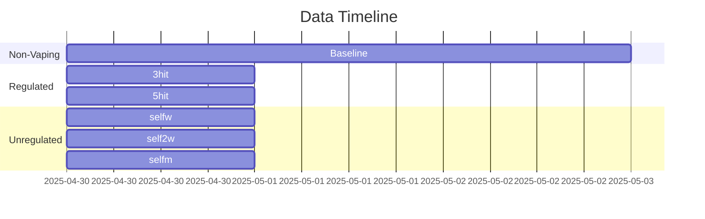

> [!warning] README
> Vaping is largely an unknown and risk:reward is highly personal and based on your values and your mind, don't start vaping because you see a single post online.

> [!info]- Info
> [[Health]], [[Productivity]]
> Last Update: **May-2025**

---

# Misc infodump

- Vaping is absolutely safer than smoking
- The lung risk of vaping is _likely_ offset by regular cardio exercise
- Nicotine probably enhances productivity (task initiation and agency)
- Nicotine does enhance, focus, memory, mood and lowers stress
- Vaping is less addictive than cigarettes

# Usage

```mermaid
xychart-beta
      title "Usage over time"
      x-axis [w1, w2, w3, w4, w5, w5, w5, w5, w7, w8]
      y-axis "Puff count"
      line [0, 0, 0, 0, 0, 0, 0, 0, 0, 0]
```

---

# Vaping and health metrics

| Legend     | Explanation/Context                                                                                |
| ---------- | -------------------------------------------------------------------------------------------------- |
| Bar        | Sleep score                                                                                        |
| Orange     | HRV                                                                                                |
| Grey       | RHR                                                                                                |
| Light Grey | Productivity                                                                                       |
| 3-hit      | One hit in morning, One in afternoon, One in evening                                               |
| 5-hit      | morning, afternoon (x2), evening                                                                   |
| self-w     | self regulating (whenever I feel like it) for a week                                               |
| self-2w    | self regulating for 2 weeks                                                                        |
| self-m     | self regulating for 1 month                                                                        |
| prod       | productivity as benchmarked by time spent on one specific project, not my overall productive time. |



# Nicotine misc

- onset 5-20 seconds, lasts 30-120 minutes
- 14 day taper, 7 day off (every 6 months)

## Vape Juices

- complex flavours (cinnamon, fruity etc) carry more risk
- "popcorn lung" was caused by diacetyl not pg

# DATA



## Baseline data

| Date     | sleep score | Efficiency | REM (%) | Deep (%) | RHR    | HRV   | Prod    |
| -------- | ----------- | ---------- | ------- | -------- | ------ | ----- | ------- |
| 30/04/25 | 89          | 91%        | 25%     | 20%      | 53 bpm | 33 ms | 25 mins |
| 01/05/25 | 75          | 87%        | 20%     | 23%      | 55 bpm | 31 ms | 0 mins  |
| 02/05/25 | 72          | 89%        | 24%     | 32%      | 55 bpm | 31 ms | 20 mins |
| 03/05/25 | 74          | 86%        | 22%     | 24%      | 54 bpm | 36 ms | 0 mins  |
| 04/05/25 | 77          | 87%        | 20%     | 26%      | 57 bpm | 25 ms | 0 mins  |
| 05/05/25 | 66          | 89%        | 19%     | 26%      | 55 bpm | 35 ms |         |
